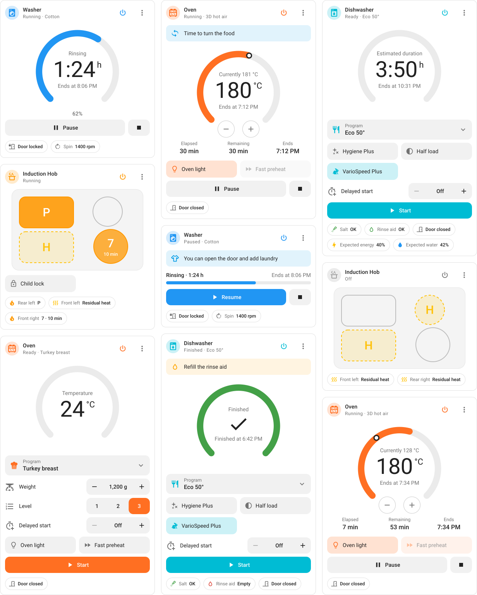
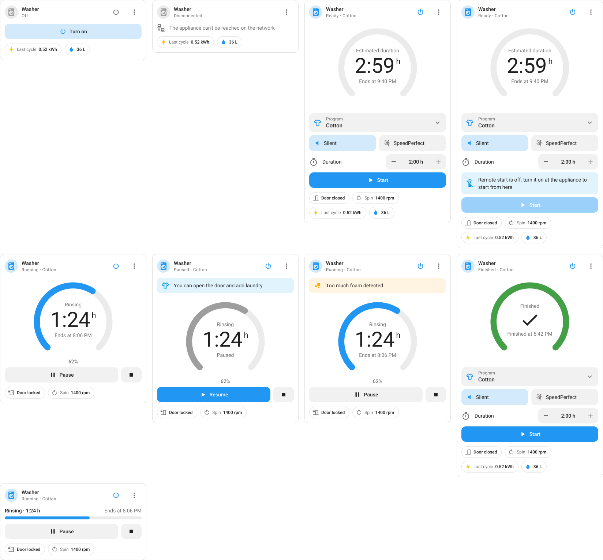
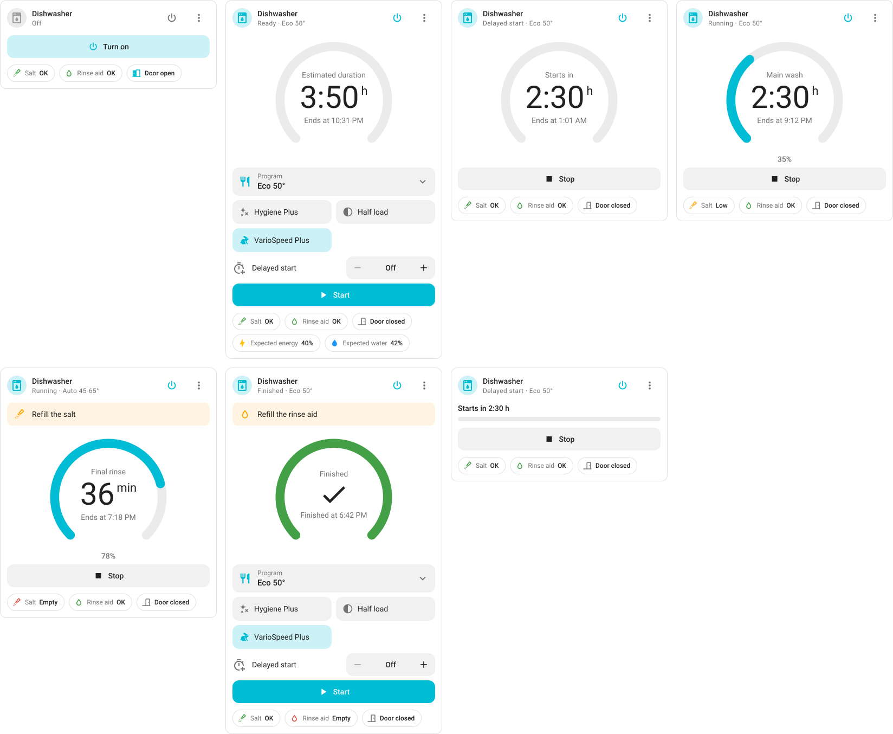
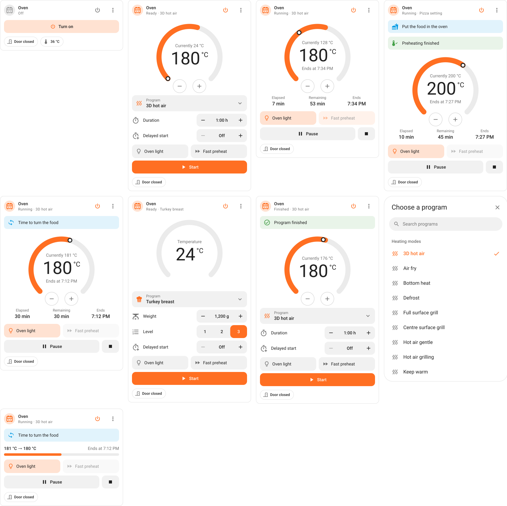
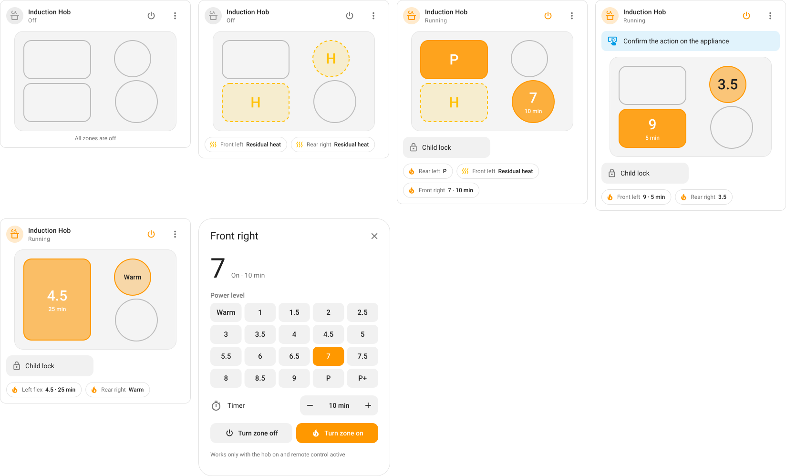

<h1 align="center">Bosch Home Connect Cards</h1>

<p align="center">
  <strong>Home Assistant cards for Bosch and Siemens appliances,<br>
  with live status, program picker and controls.</strong>
</p>

<p align="center">
  <a href="https://github.com/fabioscarparo/bosch-homeconnect-cards/releases/latest"></a>
  <a href="https://hacs.xyz/"></a>
  <a href="https://www.home-assistant.io/"></a>
  <a href="https://developer.mozilla.org/docs/Web/JavaScript"></a>
  <a href="LICENSE"></a>
</p>

Lovelace cards for **Bosch** and **Siemens** appliances connected through
[Home Connect Local](https://github.com/chris-mc1/homeconnect_local_hass),
the integration that talks to the appliances directly on your network.

There is one card for each type of appliance:

- **Washer** - program and options, remaining time, spin speed and the
  energy and water of the last cycle
- **Dishwasher** - program and options, delayed start, salt and rinse aid
- **Oven** - heating mode, temperature, duration, automatic recipes and
  cooking hints such as "time to turn the food"
- **Induction hob** - a live map of the cooking zones with power level,
  timer and residual heat, flex zones included

Pick the appliance and the card does the rest: **no entity ids to type**,
and renamed entities keep working.

<picture>
  <source media="(prefers-color-scheme: dark)" srcset="images/wall-dark.svg">
  
</picture>

---

## Installation

### Requirements

- **Home Assistant 2024.8** or later, with [HACS](https://hacs.xyz)
  installed
- The **Home Connect Local** integration (`homeconnect_ws`), with your
  appliances already set up

> [!IMPORTANT]
> The cards work with Home Connect Local only. The official Home Connect
> integration of Home Assistant creates different entities, so the cards
> can't find them.

### Install with HACS

The cards are not in the default HACS store: add them as a custom
repository.

1. Open **HACS**, then **⋮ → Custom repositories**.
2. Add `https://github.com/fabioscarparo/bosch-homeconnect-cards` with
   type **Dashboard**.
3. Search for **Bosch Home Connect Cards**, open it and select
   **Download**. HACS adds the dashboard resource for you and lets you know
   when a new version is out.
4. Reload the browser.

### Manual installation

1. Copy `bosch-homeconnect-cards.js` into the `www/bosch-homeconnect-cards/`
   folder of your Home Assistant configuration.
2. Go to **Settings → Dashboards → ⋮ → Resources → Add resource**, enter
   `/local/bosch-homeconnect-cards/bosch-homeconnect-cards.js` and choose
   **JavaScript module**. The **Resources** menu shows up with **Advanced
   mode** turned on in your user profile.
3. Reload the browser.

## Adding a card

1. Open a dashboard and select **Edit dashboard** (pencil).
2. Select **Add card** and search for **Home Connect**: you find
   **Home Connect Washer**, **Dishwasher**, **Oven** and **Induction hob**.
3. Pick the appliance in the visual editor and save. The editor
   preselects the first appliance of the right type.

### If the card shows an error

Right after installing or updating the cards, the companion app can keep
showing the frontend from its cache: the cards are missing from the
picker, or the dashboard shows an error such as *Custom element doesn't
exist: homeconnect-washer-card*. Reset the app's frontend cache, then
reopen the app:

- **Android:** **Settings → Companion app → Troubleshooting → Reset
  frontend cache**
- **iOS:** **Settings → Companion app → Debugging → Clear web view cache**

In a browser, a hard reload is enough: **Ctrl+Shift+R**, or
**Cmd+Shift+R** on macOS.

### Configuration

```yaml
type: custom:homeconnect-washer-card
device_id: 0123456789abcdef0123456789abcdef
name: Washer               # optional: defaults to the device name
icon: mdi:washing-machine  # optional
color: blue                # optional: a Home Assistant color name or any CSS color
hide_hero: false           # optional: compact view, without the dial
```

| Card | Type | Default color |
|---|---|---|
| Washer | `custom:homeconnect-washer-card` | `blue` |
| Dishwasher | `custom:homeconnect-dishwasher-card` | `cyan` |
| Oven | `custom:homeconnect-oven-card` | `deep-orange` |
| Induction hob | `custom:homeconnect-hob-card` | `orange` |

The compact view (`hide_hero`) is not available on the hob card, where the
map of the zones is the card itself.

### Finding the `device_id`

The visual editor fills it in for you. For YAML, go to **Developer tools →
Template** and paste:

```jinja

{{ device_attr(d, 'name') }}: {{ d }}

```

It prints one line per appliance:

```text
Washer: 8c1f5e2a9b7d4e3f6a0b1c2d3e4f5a6b
Oven: 4f1c9e0a7b2d4c3e8a6f5b1d2c3e4f50
```

In a browser you can also open the device page: the ID is the last part of
the address, after `/config/devices/device/`.

## The cards

### Washer

The dial shows the remaining time, the progress and the current phase of
the program. Before starting you choose the program and its options, such
as **SpeedPerfect** or **Silent**, and the duration when the program allows
it. While the program runs you can pause it, resume it or stop it, and the
card tells you when laundry can still be added.

<picture>
  <source media="(prefers-color-scheme: dark)" srcset="images/washer-dark.svg">
  
</picture>

### Dishwasher

Same dial as the washer, plus **delayed start**: set the delay, and the
start button turns into **Start in 2:30 h**. Salt and rinse aid are always
in sight, with an alert when they run out.

<picture>
  <source media="(prefers-color-scheme: dark)" srcset="images/dishwasher-dark.svg">
  
</picture>

### Oven

The dial works like the thermostat card: the arc is the target
temperature, the dot is the current one, and the minus and plus buttons
change it in steps of 5 °C. The program list is grouped into heating modes, automatic
programs, recommended dishes and cleaning, with a search field. Controls
follow the program: weight and level for automatic recipes, pyrolysis
level for cleaning, duration and delayed start for heating modes.

<picture>
  <source media="(prefers-color-scheme: dark)" srcset="images/oven-dark.svg">
  
</picture>

### Induction hob

A map of the hob with every cooking zone: power level, timer and residual
heat at a glance, and the **flex zone** drawn as one surface when it is in
use. Select a zone to see its details and, where the integration allows
it, to switch it on with a power level and a timer.

<picture>
  <source media="(prefers-color-scheme: dark)" srcset="images/hob-dark.svg">
  
</picture>

## Optional features

Some parts appear only when the integration provides what they need:

| Feature | Needs |
|---|---|
| Energy and water of the last cycle | The "last program" consumption sensors |
| Hob zone control | The `homeconnect_ws.start_hob_program` action |

> [!TIP]
> Bosch and Siemens appliances accept a remote start only after you turn on
> **Remote Start** at the appliance itself. Until then the card disables
> **Start** and tells you why.

## Languages

The cards speak English and Italian. Labels, states, program names and the
visual editor follow the language of each user's profile, with English for
any other language. Program names ship with the cards, because the
integration doesn't translate all of them.

## How it works

### Entities found by device

The cards never ask for entity ids. They read the entity registry, keep the
entities of the selected appliance and recognize each one by its
translation key. Renamed entities keep working, and entities left behind by
older versions of the integration are ignored.

### Actions

Every control calls a standard Home Assistant action, so what happens is
easy to follow in the logbook and in automations:

| Control | Action |
|---|---|
| Program, level | `select.select_option` |
| Temperature, duration, delayed start, weight | `number.set_value`, sent after a short pause so repeated taps add up |
| Options, power, light | `switch.toggle` |
| Start, pause, resume, stop | `button.press` |
| Start with a delay | `homeconnect_ws.start_program` |
| Hob zones | `homeconnect_ws.start_hob_program` |

## Development

The cards are a single JavaScript file, with no build step and no
dependencies.

```bash
python3 tools/serve.py
```

- `http://localhost:8765/demo/` shows the cards with demo data: every
  scenario, light and dark, English and Italian.
- `http://localhost:8765/tools/render.html` renders the images in
  `images/` from the real cards, as plain vector SVG with an embedded
  Roboto subset. It also checks that the columns of the wall stay aligned.

## Disclaimer

This is a community project, not affiliated with or endorsed by BSH
Hausgeräte GmbH, Bosch or Siemens. Home Connect is a trademark of BSH.

## License

MIT, see [LICENSE](LICENSE).
